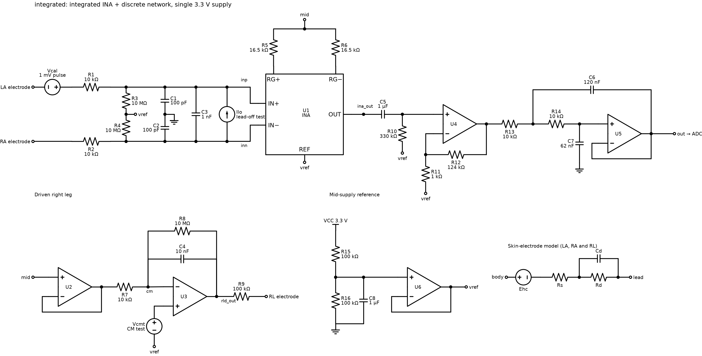
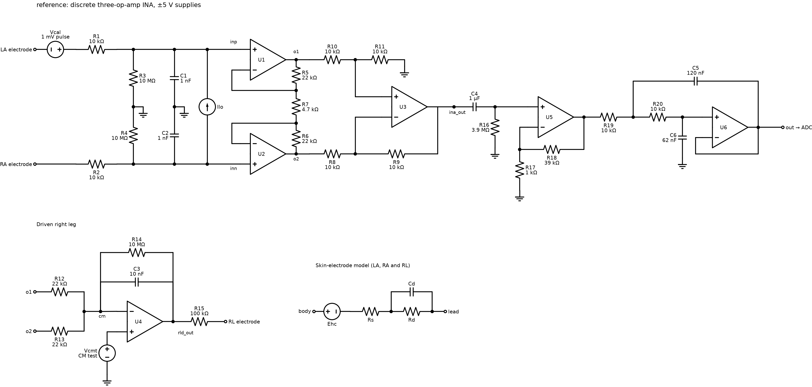

# Circuits, specifications and modelling decisions

Design record of phase 2 of the
[research plan](linea_diagnostico_fallos_frontend_ecg.md): what is implemented in
`src/ecgfd/`, why each value was chosen, where each specification limit comes from,
and what remains to be confirmed. The literature review is in
[SOTA/](SOTA/sota_diagnostico_fallos_frontend_ecg.md).

## The two circuits

Both are single-lead front-ends (lead I = LA − RA) with the same signal chain. Print
a netlist with `ecgfd --circuit <name> netlist` and the parts with `components`.

| | `integrated` (main) | `reference` |
|---|---|---|
| Instrumentation amplifier | TI INA333 (U1), external gain resistor split in two (R5, R6) | discrete, three op-amps (U1–U3, R5–R11) |
| Supply | single 3.3 V, mid-supply reference (R15, R16, C8, U6) | ±5 V |
| First-stage gain | 4.03 | 10.36 |
| Total gain | 278 | 414 |
| Injectable passives | 24 (16 R, 8 C) | 26 (20 R, 6 C) |
| Discrete op-amps | 5 | 6 |
| Fault conditions | 293 | 307 |
| ADC range | 0–3.3 V | ±2.5 V |

The drawings are generated by `python scripts/draw_schematics.py` (SVG versions sit
next to the PNG files). Labels come from the component table used for simulation;
`Vcal`, `Vcmt` and `Ilo` are the internal test sources, and nets with the same name
(`vref`, `mid`, `o1`, `o2`) are connected.

## Design of the discrete network

Designators are those of the `integrated` circuit; the `reference` circuit uses the
same values for the shared stages.

| Parts | Value | Reason |
|---|---|---|
| R1, R2 | 10 kΩ | Series protection of the inputs and resistive half of the RFI filter. Their thermal noise (13 nV/√Hz each) stays below that of the INA333 |
| C1, C2 | 100 pF | Common-mode RFI filter with R1/R2, corner at 159 kHz, far above the ECG band |
| C3 | 1 nF | Differential RFI filter, ten times C1/C2 so that their 5 % mismatch barely converts common mode into differential |
| R3, R4 | 10 MΩ | Bias path for the inputs and lead-off pull to the reference. The 20 MΩ differential input impedance gives a 3 % loss in the 620 kΩ input-impedance test (limit 20 %) |
| R5, R6 | 16.5 kΩ | G = 1 + 100 kΩ / 33 kΩ = 4.03. A ±300 mV electrode offset becomes ±1.21 V at the INA output, inside the ±1.6 V available on 3.3 V. With G = 11 the circuit failed the offset test |
| R7, C4 | 10 kΩ, 10 nF | RLD integrator, unity gain at 1.6 kHz: about 30 dB of extra common-mode reduction at 50 Hz |
| R8 | 10 MΩ | Limits the DC gain of the RLD integrator to 1000 so that it cannot drift into a rail |
| R9 | 100 kΩ | Limits the current into the RL electrode to 33 µA with the amplifier output at a rail |
| C5, R10 | 1 µF, 3.9 MΩ | High-pass with τ = 3.9 s (0.041 Hz). A 3 mV, 100 ms impulse shifts the baseline by 76 µV (limit 100 µV), which a 0.5 Hz corner cannot meet |
| R11, R12 | 1 kΩ, 68 kΩ | Second-stage gain 69, total 278: a ±5 mV input uses ±1.39 V of the ±1.6 V output range |
| R13, R14, C6, C7 | 10 kΩ, 10 kΩ, 120 nF, 62 nF | Sallen-Key Butterworth at 185 Hz (Q = 0.70). The response at 150 Hz is 0.83 of mid-band (limit 0.70) and stays above 0.79 with 5 % capacitors |
| R15, R16, C8 | 100 kΩ, 100 kΩ, 1 µF | Mid-supply reference of 1.65 V, filtered at 3 Hz and buffered by U6 |

In the `reference` circuit the first stage has G = 1 + 44 kΩ / 4.7 kΩ = 10.36 (a
±300 mV offset gives ±3.1 V, inside the ±3.5 V swing), a unity-gain difference stage
with 10 kΩ resistors, and a second-stage gain of 40 (total 414, ±6 mV input range in
the ±2.5 V ADC range).

## Models

### INA333

The integrated amplifier is the Texas Instruments INA333 (zero-drift, 1.8–5.5 V,
G = 1 + 100 kΩ / Rg). It is simulated with a behavioural model built from data sheet
SBOS445C: the three-amplifier structure with 50 kΩ feedback and 150 kΩ difference
resistors, plus an error source for offset and finite common-mode rejection.

| Parameter | Model | Data sheet |
|---|---|---|
| CMRR at G = 4 | 102 dB, Monte Carlo 92–112 dB | 80/90 dB (min/typ) at G = 1, 100/110 dB at G = 10; interpolated |
| Offset, referred to the input | ±44 µV | ±25 µV ± 75 µV / G maximum |
| Gain error | ±0.25 % | ±0.25 % maximum at G = 10 |
| Noise | 35 nV/√Hz per input amplifier | 50 nV/√Hz referred to the input |
| Bandwidth | GBW 350 kHz | 35 kHz at G = 10 |
| Output swing | 50 mV from the rails | 50 mV maximum |

`scripts/validate_ina_model.py` compares it with the TI macromodel (SBOM382) in the
same bench:

| | Behavioural | TI macromodel |
|---|---|---|
| Gain at 10 Hz | 4.03 | 4.03 |
| CMRR at 50 Hz | 102 dB | 100.2 dB |
| −3 dB bandwidth | 72 kHz | 166 kHz |
| Offset, referred to the input | 0 (drawn per circuit) | 16 µV |
| Output swing from the rails | 51 mV | 25–27 mV |

Gain and CMRR agree; the bandwidth differs but both are three orders of magnitude
above the ECG band; the swing of the behavioural model is the data sheet maximum.

**Why the TI macromodel is not used for the dataset.** It runs in ngspice (PSpice
compatibility mode) on its own, but inside the complete front-end it took 39 s per
case against 0.2 s, and the operating point converged to a wrong solution with every
node near ground. It also has fixed typical parameters, so it allows neither Monte
Carlo of the block nor faults in it, and its licence does not allow redistribution.
Its noise analysis gave implausible values in ngspice and was not compared.

Not modelled: input bias current (±200 pA maximum), 1/f noise, slew rate.

### Discrete op-amps

Single-pole behavioural model with offset, white noise and output clamping. The
`integrated` circuit assumes a precision rail-to-rail CMOS class (offset ±0.5 mV,
GBW 1 MHz, 30 nV/√Hz); the `reference` circuit uses TL07x-like figures (±3 mV,
3 MHz, 18 nV/√Hz). No specific part is fixed for them.

### Electrodes and patient

Each electrode is a half-cell potential in series with Rs and Rd ‖ Cd, the single
time-constant model of Swanson and Webster. Each simulated case draws a family (gel
or dry, 50/50) and an electrode type of that family, shared by the three electrodes.
For dry electrodes it also draws one of the six measured subjects: that subject's
contact resistance replaces the median Rd, and Cd is scaled to keep the time
constant. Finally every parameter of every electrode is drawn log-uniformly between
half and twice that value, so imbalance is part of the normal variation.

| Family | Type | Rs | Rd (median) | Cd (median) | Rd of the six subjects |
|---|---|---|---|---|---|
| Gel | Ag/AgCl with gel | 300 Ω | 51 kΩ | 47 nF | not available |
| Dry | Conductive polymer | 110 Ω | 1.01 MΩ | 9.3 nF | 0.26–2.8 MΩ |
| Dry | Conductive fabric, no membrane | 125 Ω | 4.47 MΩ | 0.88 nF | 1.0–25 MΩ |
| Dry | Conductive fabric with membrane | 113 Ω | 3.69 MΩ | 1.35 nF | 0.66–68 MΩ |
| Dry | Stainless steel | 51 Ω | 61 kΩ | 121 nF | 0.6 kΩ–0.44 MΩ |
| Dry | Silver | 84 Ω | 297 kΩ | 119 nF | 0.8 kΩ–0.50 MΩ |
| Dry | Platinum | 24 Ω | 209 kΩ | 10.9 µF | 0.8 kΩ–0.58 MΩ |

Sources and assumptions:

- **Dry medians**: Table 3 of *Scientific Reports* 14:8882 (2024), fitted after 10
  minutes of settling. The paper measures a pair of electrodes in series, so the
  values per electrode are half the resistances and twice the capacitance.
- **Dry subjects**: open data of the same paper (doi:10.17632/j9rt95468p.5), mean |Z|
  from 1 to 100 Hz of each subject at minute 10, halved and taken as that subject's
  Rd. The spread between subjects is large: a geometric standard deviation of 2.3 for
  the polymer, 4–5 for the fabrics and 17–31 for the solid metals, which split into
  subjects in the megaohm range and subjects in the kiloohm range.
- **Gel**: Rd ‖ Cd is the network that IEC 60601-2-25 puts in series with each lead to
  represent the skin-electrode impedance. Rs and the absence of a subject spread are
  assumed; neither paper measures gel electrodes.
- **Assumed for every type**: the factor-of-two spread between the electrodes of one
  case and the ±5 mV spread of the half-cell potential.

The dry values agree in order of magnitude with *Sensors* 22:8510 (2022), which fits
1.6 MΩ ‖ 151 nF for the stratum corneum under a 4 cm² stainless-steel electrode on a
dry skin phantom; it uses a different circuit and no gel electrodes, so it is not
used for parameter values.

The patient is a body node coupled to mains (2 pF) and earth (200 pF), with the
amplifier common isolated by 200 pF (Winter & Webster, 1983).

### Internal test sources

- `Vcal`, floating, in series with the LA lead: the 1 mV calibration pulse (C3) and
  the differential tone (C2). The response depends on the circuit and the electrodes.
- `Vcmt`, at the reference input of the RLD amplifier: the body follows it, which
  gives a common-mode tone and the CMRR estimate of C2.
- `Ilo`, a differential current into the inputs: the output tone is proportional to
  the contact impedance of both electrodes, as in AC lead-off detection (C4).

These are ideal models of the self-test signals. How the instrument generates them is
outside the scope of the study and is stated as a modelling assumption.

## Specifications

The circuit is treated as a diagnostic electrocardiograph, so the specifications
follow IEC 60601-2-25:2011, clause 201.12.4. `src/ecgfd/specs.py` evaluates them for
every case in a second ngspice run, with the standard test networks instead of the
patient's electrodes.

| Specification | Test | Limit | Subclause |
|---|---|---|---|
| `gain_error` | gain at 10 Hz against the nominal circuit | ≤ 5 % | 201.12.1.101.2 and 201.12.4.107.1.2: amplitudes within 5 % |
| `resp_dev_lf` | response from 0.67 to 40 Hz relative to 10 Hz | within ±10 % | Table 201.107, test A |
| `resp_min_hf` | response from 40 to 150 Hz relative to 10 Hz | ≥ −30 % | Table 201.107, tests B and C |
| `resp_max_hf` | response from 40 to 500 Hz relative to 10 Hz | ≤ +10 % | Table 201.107, tests B, C and D |
| `impulse_offset_uv`, `impulse_slope_uvs` | baseline after a 3 mV, 100 ms impulse | ≤ 100 µV, ≤ 300 µV/s | 201.12.4.107.1.1.2 |
| `cmrr_db` | 20 V rms behind a 100 pF divider (10 V rms unloaded, 200 pF source) at 50 and 60 Hz; 51 kΩ ‖ 47 nF in each lead in turn, without and with ±300 mV in series; RLD active | ≥ 89 dB, i.e. ≤ 1 mV peak-to-valley at the input | 201.12.4.105.1, Figure 201.105 |
| `noise_uvpp` | input-referred, 0.05–150 Hz, 51 kΩ ‖ 47 nF in every lead | ≤ 30 µV peak-to-valley | 201.12.4.106.1 |
| `zin_drop` | signal loss with 620 kΩ ‖ 4.7 nF in series with a lead, at 0.67 and 40 Hz, with ±300 mV | ≤ 20 % (2.5 MΩ) | 201.12.4.103 |
| `offset_gain_error` | gain change at 10 Hz with ±300 mV at one input | ≤ 5 % | 201.12.4.107.2 |
| `input_range_mv` | input amplitude that fits the output range, given gain and output offset | ≥ 5 mV | 201.12.4.107.2 |

All limits were checked against the text of the standard (UNE-EN 60601-2-25:2016,
identical to IEC 60601-2-25:2011). The sampling requirements of 201.12.4.107.3 are
met by the acquisition assumed in the configuration: 1000 samples/s (at least 500
required) and 2.9 µV per LSB referred to the input (at most 5 µV).

The standard offers two ways of checking the frequency response; the sinusoidal and
impulse tests of 201.12.4.107.1.1 are used here, not the calibration ECGs of
201.12.4.107.1.2. Requirements that do not apply to a single-lead analog front-end
are left out: lead networks, recovery time after lead switching, overload tolerance,
line-frequency filter distortion, channel crosstalk, pacemaker pulses.

Simplifications: noise is taken as 6.6 times the rms value instead of a 10 s
peak-to-valley reading; the dynamic range is computed from the operating point
instead of being exercised with a ±5 mV signal; the impulse test reads the baseline
50 ms after the impulse.

E1 (`python experiments/e1_nominal_validation.py`) closes the phase: both nominal
circuits and 500 healthy Monte Carlo circuits of each meet all eleven specifications.

### Labels

Because the specifications belong to the circuit, an electrode fault leaves the case
compliant; the self-test features do change, and the origin label records why.

1. **Functional**: `compliant`, `violated` (names of the failed specifications),
   plus the continuous `spec_*` values for alternate-test regression.
2. **Localisation**: `target` (component, or electrode).
3. **Origin**: `origin` = none / circuit / electrode.

`is_faulty` keeps the percentage-severity view (a fault was injected), which E4
compares against `compliant`.

## Open points

Everything still to be confirmed or decided (assumptions without a source, open
design decisions, features not implemented) is tracked in one place:
[pendientes.md](pendientes.md).

## Consequences worth knowing before the dataset

- **High-impedance dry electrodes attenuate the signal in service.** The megaohm-level
  impedance of polymer and fabric electrodes (and of solid ones on some subjects)
  forms a divider with the 10 MΩ bias resistors and with the 1 nF differential RFI
  capacitor, so healthy circuits can measure well below the nominal gain through
  `Vcal`. The circuit itself is compliant, since the standard only asks for 2.5 MΩ.
  It was decided to keep every electrode type and treat this as part of the problem;
  the `report.md` of each dataset gives the gain measured per electrode type, and the
  experiments can be repeated without the porous electrodes (`--electrode-kinds`).
- **Electrode degradation is relative to the family.** A dried gel electrode can have
  the impedance of a healthy dry one.
- **The system CMRR is dominated by the RLD.** With the INA333 degraded to 50 dB the
  nominal circuit still measures 117 dB in the 89 dB test, so that block fault is
  functionally benign.
- **Slow self-test tone.** The 0.041 Hz high-pass makes the 0.05 Hz tone of C2 the one
  that sees C5 and R10; measuring it takes tens of seconds.
- **AC features are small-signal.** A fault that would saturate the output under a
  real tone can show a huge linear gain; the measurement model clips tones to the ADC
  range.
- **DC nodes.** The main feature sets read `out` and `ina_out`, which needs one spare
  ADC channel; `rld_out` would need another and only enters the extended set `C1x`.

## Sources

- UNE-EN 60601-2-25:2016 (IEC 60601-2-25:2011), *Particular requirements for the basic
  safety and essential performance of electrocardiographs*. Licensed copy, kept
  outside version control in `docs/normative_and_papers/`.
- Joutsen, A. et al. (2024). ECG signal quality in intermittent long-term dry
  electrode recordings with controlled motion artifacts. *Scientific Reports*, 14,
  8882. doi:10.1038/s41598-024-56595-0
- Goyal, K., Borkholder, D. A., Day, S. W. (2022). Dependence of skin-electrode
  contact impedance on material and skin hydration. *Sensors*, 22(21), 8510.
  doi:10.3390/s22218510
- Texas Instruments, *INA333 data sheet*, SBOS445C, and PSpice model SBOM382:
  <https://www.ti.com/product/INA333>
- Winter, B. B., Webster, J. G. (1983). Driven-right-leg circuit design. *IEEE
  Transactions on Biomedical Engineering*, 30(1), 62–66.
